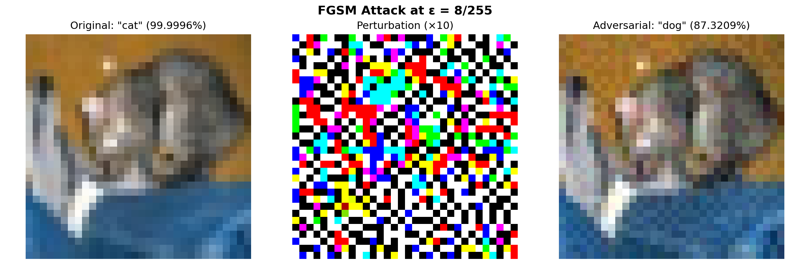
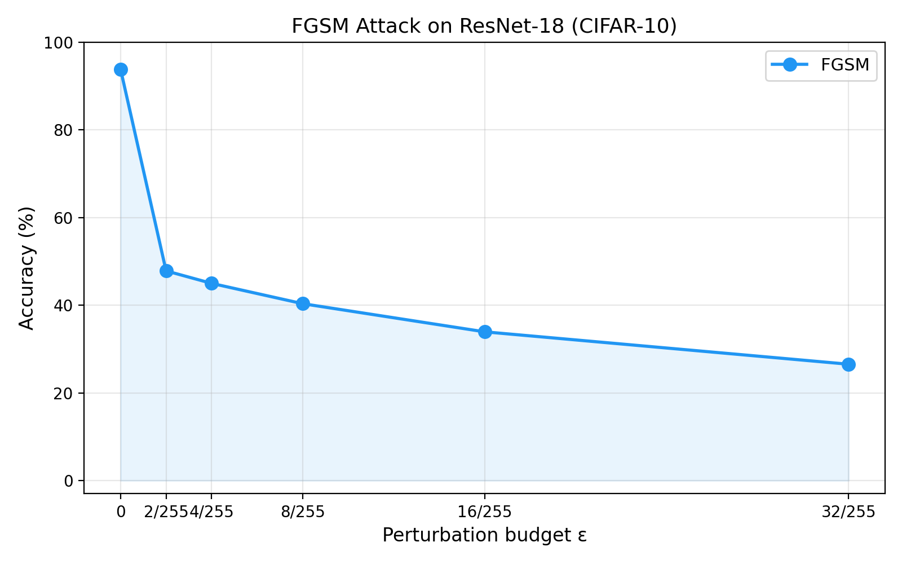
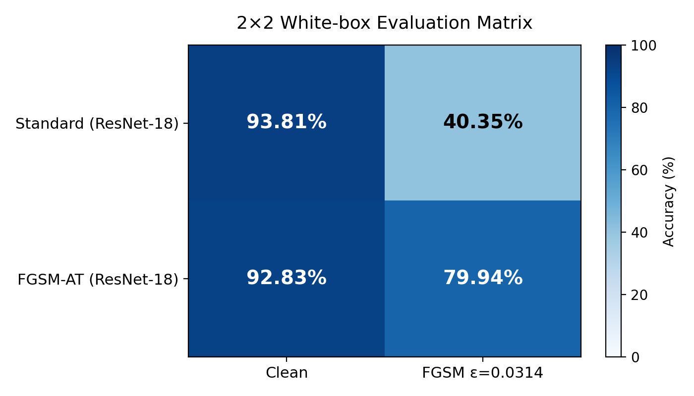
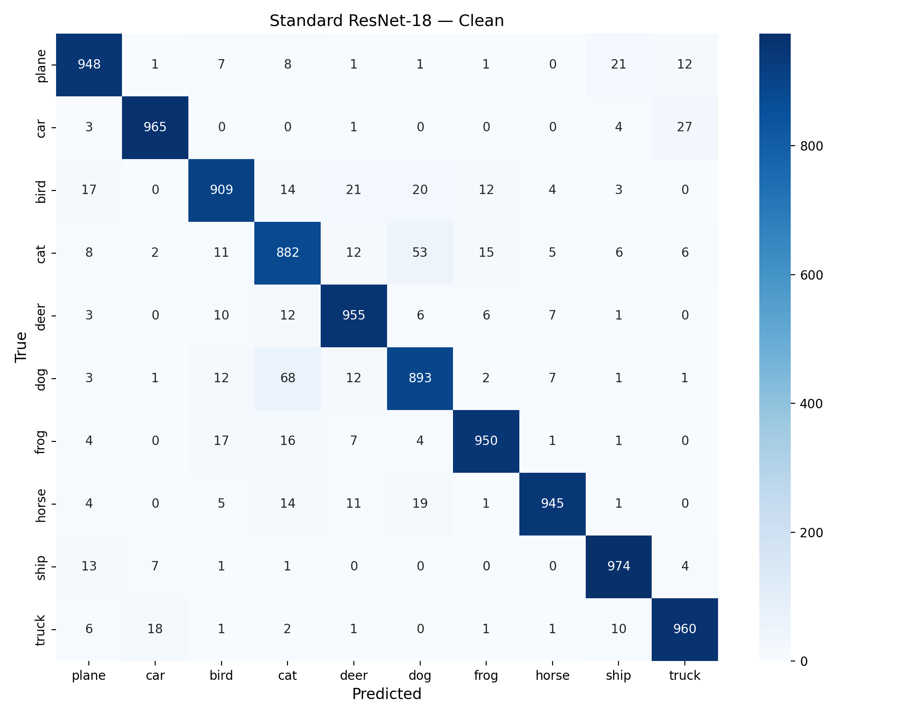
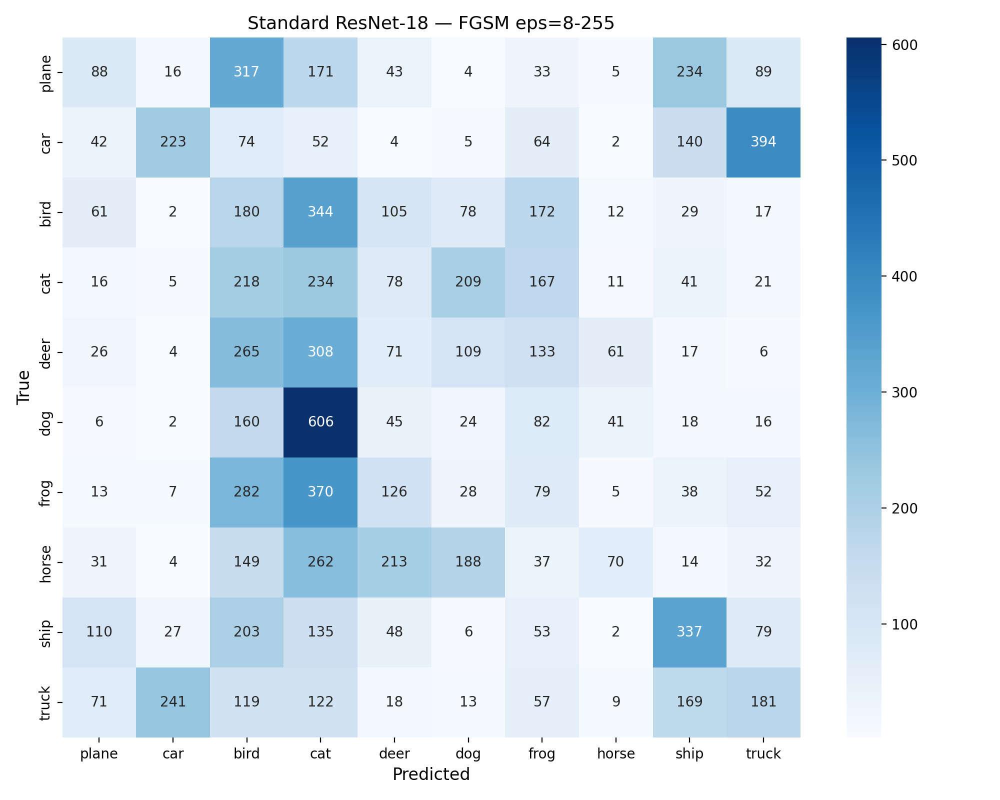
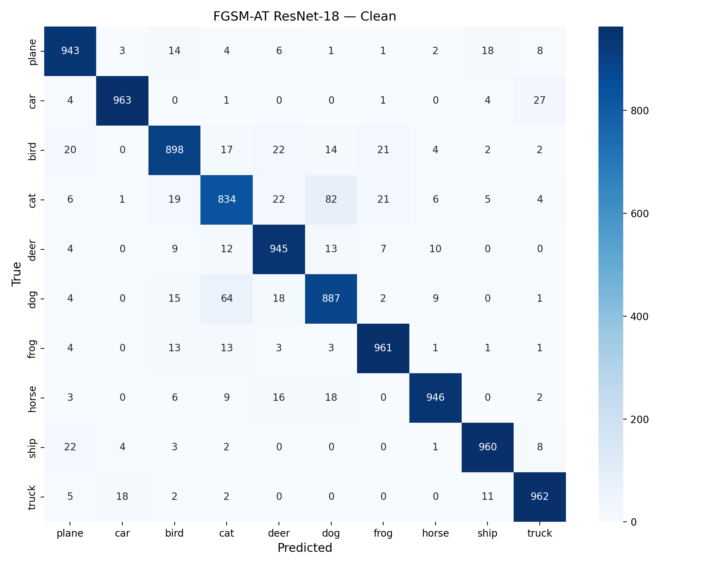
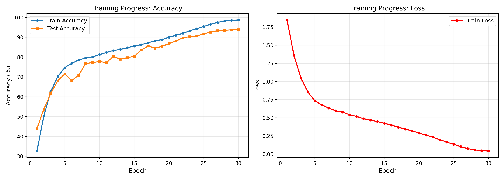
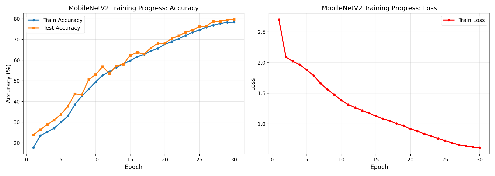

<div align="center">

# Adversarial Robustness of Neural Networks on CIFAR-10

FGSM attacks, FGSM adversarial training, and cross-architecture transferability

<b>Tools:</b> PyTorch | CIFAR-10 | FGSM | Kaggle (T4 GPU)<br>
<b>Authors:</b> Asmar Aliyeva, Ilaha Mustafayeva, Nazrin Abdullayeva<br>
<b>Affiliation:</b> French-Azerbaijani University (UFAZ)<br>
<b>Supervisor:</b> Prof. Rauf Fatali<br>
<b>Period:</b> January – April 2026

<br>



<sub>Original image classified as "cat" (99.99%), FGSM perturbation (×10), and the adversarial image classified as "dog" (87.3%), ε = 8/255.</sub>

</div>

---

## Overview

This project studies how a ResNet-18 trained on CIFAR-10 reacts to FGSM adversarial attacks, whether FGSM adversarial training makes it more robust, and whether adversarial examples crafted on ResNet-18 also fool a MobileNetV2 that the attacker never had access to.

Research questions:

1. How vulnerable is a normally trained ResNet-18 to FGSM at different perturbation budgets?
2. Does FGSM adversarial training improve robustness, and what does it cost in clean accuracy?
3. Do FGSM examples transfer from ResNet-18 to MobileNetV2?

## Results

All attacks are L∞ FGSM with ε measured in pixel space. Evaluation uses the full CIFAR-10 test set (10,000 images).

### Accuracy under FGSM (%)

| ε | 0 (clean) | 2/255 | 4/255 | 8/255 | 16/255 | 32/255 |
|---|:---:|:---:|:---:|:---:|:---:|:---:|
| Standard ResNet-18 | 93.81 | 32.75 | 20.26 | 14.87 | 11.38 | 9.31 |
| FGSM-AT ResNet-18 | 92.99 | 34.12 | 40.30 | 99.46 | 21.45 | 10.11 |

The FGSM-AT model was trained with ε = 8/255.

| Model | Macro-F1, clean | Macro-F1, FGSM ε = 8/255 |
|---|:---:|:---:|
| Standard ResNet-18 | 0.938 | 0.149 |
| FGSM-AT ResNet-18 | 0.930 | 0.995 |

<table>
  <tr>
    <td width="50%"></td>
    <td width="50%"></td>
  </tr>
  <tr>
    <td align="center"><sub>Standard ResNet-18 under FGSM</sub></td>
    <td align="center"><sub>Clean and FGSM (ε = 8/255) accuracy of both models</sub></td>
  </tr>
</table>

### Transferability from ResNet-18 to MobileNetV2 (ε = 8/255)

Adversarial examples are generated on ResNet-18 and evaluated on MobileNetV2 (black-box setting).

| Model | Clean | Adversarial | Drop |
|---|:---:|:---:|:---:|
| ResNet-18 (source, white-box) | 93.81% | 14.87% | 78.94 pp |
| MobileNetV2 (target, black-box) | 79.63% | 64.06% | 15.57 pp |

Of the test images MobileNetV2 classified correctly, 21.8% were misclassified after the transferred attack. Of the attacks that fooled ResNet-18, 39.9% also fooled MobileNetV2.

<details>
<summary><b>Confusion matrices and training curves</b></summary>

<br>

| | |
|---|---|
|  |  |
| <sub>Standard ResNet-18, clean</sub> | <sub>Standard ResNet-18, FGSM ε = 8/255</sub> |
|  |  |
| <sub>FGSM-AT ResNet-18, clean</sub> | <sub>FGSM-AT ResNet-18, FGSM ε = 8/255</sub> |
|  |  |
| <sub>ResNet-18 training</sub> | <sub>MobileNetV2 training</sub> |

</details>

## Discussion

**RQ1.** The standard ResNet-18 has almost no robustness to FGSM. At ε = 2/255 its accuracy already drops from 93.81% to 32.75%, and at ε = 8/255 it reaches 14.87%.

**RQ2.** FGSM adversarial training did not give real robustness. At its training budget (ε = 8/255) the FGSM-AT model reaches 99.46%, which is higher than its own clean accuracy of 92.99%. At the smaller budgets 2/255 and 4/255, however, it only reaches 34.12% and 40.30%. A robust model would do better against weaker attacks, not worse.

This behaviour matches two known problems of single-step adversarial training. The first is catastrophic overfitting ([Wong et al., 2020](https://arxiv.org/abs/2001.03994)): FGSM training without a random start can learn to defeat the one attack it is trained on instead of becoming robust. The second is label leaking ([Kurakin et al., 2017](https://arxiv.org/abs/1611.01236)): FGSM perturbations are computed from the true label, so the model can learn to read the label from the perturbation itself, which explains accuracy above clean accuracy. The small change in clean accuracy (93.81% to 92.99%) should therefore not be read as a favourable robustness–accuracy trade-off.

**RQ3.** Adversarial examples transfer between the two architectures. Without any access to MobileNetV2, FGSM examples crafted on ResNet-18 reduce its accuracy by 15.57 percentage points, even though ResNet-18 (residual blocks, standard convolutions) and MobileNetV2 (inverted residuals, depthwise separable convolutions) are built differently.

## Method

**Data.** CIFAR-10, 50,000 training and 10,000 test images (32×32, 10 classes), normalized with the dataset mean and standard deviation. Training augmentation: random crop with padding 4 and horizontal flip.

**Models.**
- ResNet-18 (Model A), adapted to CIFAR-10: 3×3 stride-1 first convolution, no initial max-pooling.
- MobileNetV2 (Model B), with the classifier changed to 10 classes. Used only as the black-box target.

**Training.**

| | ResNet-18 | MobileNetV2 | FGSM-AT ResNet-18 |
|---|:---:|:---:|:---:|
| Optimizer | SGD, momentum 0.9 | SGD, momentum 0.9 | SGD, momentum 0.9 |
| Learning rate | 0.1 | 0.05 | 0.1 |
| Weight decay | 5e-4 | 5e-4 | 5e-4 |
| Scheduler | Cosine annealing | Cosine annealing | Cosine annealing |
| Epochs | 30 | 30 | 50 |
| Batch size | 64 | 64 | 64 |

**FGSM.** Implemented from scratch:

$$x_{adv} = \text{clip}_{[0,1]}\big(x + \varepsilon \cdot \text{sign}(\nabla_x \mathcal{L}(\theta, x, y))\big)$$

Since the model takes normalized inputs, the step is scaled by ε/σ and the clipping bounds are converted to normalized space, so ε is a pixel-space budget. The implementation was checked against [torchattacks](https://github.com/Harry24k/adversarial-attacks-pytorch): both give the same accuracy on a test batch, and the mean absolute pixel difference between the two sets of adversarial images is 2 × 10⁻⁶.

**FGSM adversarial training.** Each batch is split in half: the first half is kept clean and the second half is replaced by FGSM examples (ε = 8/255, no random start) generated against the current model. The model is put in evaluation mode while the attack is generated and back in training mode for the update.

## How to run

The notebook was run on Kaggle with a T4 GPU.

1. Import `cifar10_fgsm_adversarial_robustness.ipynb` into a Kaggle notebook and turn on GPU and Internet.
2. Set the flags in the first cell:
   - `USE_CHECKPOINTS = True` loads ResNet-18 and MobileNetV2 from the folder set in `CKPT`; `False` trains everything from scratch.
   - `RETRAIN_FGSM_AT = True` trains the FGSM-AT model (about 80 minutes on a T4); `False` loads it from `CKPT`.
3. Run all cells. CIFAR-10 is downloaded automatically.

To run locally, install the dependencies with `pip install -r requirements.txt` and change the `/kaggle/...` paths.

```
├── cifar10_fgsm_adversarial_robustness.ipynb
├── config.yaml
├── requirements.txt
└── results/
```

Model weights are not included in the repository.

## Limitations

- Only FGSM was used for evaluation. Multi-step attacks such as PGD are needed to measure the actual robustness of the FGSM-AT model.
- FGSM-AT was trained without a random start, which is the setting where catastrophic overfitting is most likely. RS-FGSM or PGD adversarial training would be the next step.
- All results come from a single run (seed 42).
- MobileNetV2 reaches only 79.63% on 32×32 images, since it was designed for 224×224 inputs.
- The training curves are plotted from the values logged during the original training runs.

## Note on the course report

The numbers here differ from our course report (April 2026). The FGSM implementation used for the report clipped the normalized images to [0, 1], which changed the images regardless of the attack and made the effective ε smaller. We fixed the attack, reran all evaluations and retrained the FGSM-AT model. The standard ResNet-18 and MobileNetV2 were not affected, since they were trained without attacks.

## References

- Szegedy et al. (2014). Intriguing properties of neural networks. *ICLR*.
- Goodfellow, Shlens & Szegedy (2015). Explaining and harnessing adversarial examples. *ICLR*.
- He, Zhang, Ren & Sun (2016). Deep residual learning for image recognition. *CVPR*.
- Papernot, McDaniel & Goodfellow (2016). Transferability in machine learning: From phenomena to black-box attacks using adversarial samples. *arXiv:1605.07277*.
- Kurakin, Goodfellow & Bengio (2017). Adversarial machine learning at scale. *ICLR*.
- Madry, Makelov, Schmidt, Tsipras & Vladu (2018). Towards deep learning models resistant to adversarial attacks. *ICLR*.
- Sandler, Howard, Zhu, Zhmoginov & Chen (2018). MobileNetV2: Inverted residuals and linear bottlenecks. *CVPR*.
- Tsipras, Santurkar, Engstrom, Turner & Madry (2019). Robustness may be at odds with accuracy. *ICLR*.
- Wong, Rice & Kolter (2020). Fast is better than free: Revisiting adversarial training. *ICLR*.
- Krizhevsky (2009). Learning multiple layers of features from tiny images. Technical report, University of Toronto.
- Kim (2020). Torchattacks: A PyTorch repository for adversarial attacks. *arXiv:2010.01950*.
